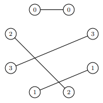
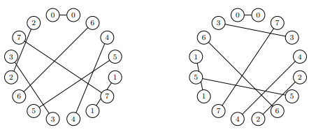
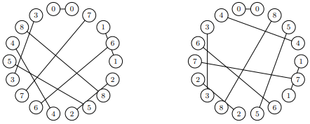
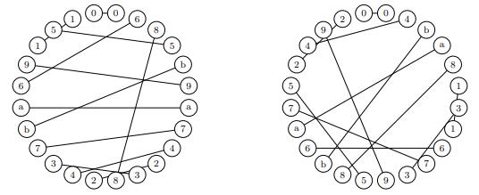

We count numbers, $\chi_n$, of "Cyclic Skolem Sequences" of order $n$ under dihedral equivalence.
These correspond to pairings of vertices on a $2n$-gon such that each vertex in its pair
is separated from its partner by a different number of edges, necessarily from the set
$\{1,2,\dots,n\}$.

The condition $n \pmod 4 = 0, 1$ is necessary for the existence of such a sequence
(similar to the linear Skolem sequences). Thus $n = 1, 4, 5, 8, 9, 12, 13, 16, 17, \dots$.

| $n$ | $(2n-1)!!$ | $\chi_n$
| ----: | ----: | ----: |
| 0 | 1 | 0 |
| 1 | 1 | 1 |
| 4 | 105 | 1 |
| 5 | 945 | 2 |
| 8 | 2027025 | 192 |
| 9 | 34459425 | 1200 |
| 12 | 316234143225 | 456960 |
| 13 | 7905853580625 | 4009024 |
| 16 | 191898783962510625 | 4377344000 |
| 17 | 6332659870762850625 | 51487228672 |
| ...

The number of ways to pair up 2 vertices is the much larger number $(2n-1)!!$ = $\frac{(2n)!}{2^n\cdot n!}$
and as n increases the probability of finding a cyclic Skolem sequence is effectively zero. However,
they're moderately inexpensive to generate. For example here are a few of length 36:

    001q1pytfmdwilxr4jan64vohuk6gaqpmczl3s5b3yhe5gckotwbx8v7u2er2987fisndjz9
    004b96vgplusmqje5xw8z35c73ft8nel7yjmcrvosufh2dk21a1winpxztqdahgbor9ky46i
    00546bwd5stpyoli1b1v7dz9rhuj7xegm9fklpswtn3hqe3jgyfarc8mkuzvo2a82ncxi64q
    005v28b2nkctxo8ryzlqi74cpw94s7kunmdv9eoiltf3ghq3djxyeza1m1fr6guhwab65jps
    007rsdhpitqbexzjnm3yol3bgc5kuwvr5s2ja2ctmg181ofak4zx8p4qy96uhifdn679wevl
    009e4tlpa4z69jqbhk6yomwvxi5b2ru25jhtcs8fnqg1i1z83c7d3pyflr7gewxvndsokamu
    00dvqlzm9h51k1bf5j9supntxrbhwymf3kov3j2a42zc847peqagi87lc6xoduse6tywgrni
    00eovxwpm3iad3fghn1t1rauzqdyoifmgph6vk4xsn648wl97tcj28b279kez5ycurb5lsqj
    00fxpdsl92y527jcv59dh7wzo3tic3pbrk6gqxhun6mb8yievsa4g8kw4lfzraeqnmj1t1uo
    00k7e1z1fl4qsnj4wu5extvc56r3bga36iy2cp28bazdomgh8w9tikxsqdul9nvpfhj7mory

where letters a to z encode values 10 to 26 (we have no idea how many of these there are but it must
be less than $\frac{72!}{2^{36}\cdot 36!}$ - which isn't saying much).

Solutions are encoded as a (cyclic) string of length 2n containing the symbols 0, 1, ..., n-1 exactly twice.
The two occurrences of symbol k are separated by exactly k characters along the shorter length of the cycle.

To canonicalise a solution with regard to its $4n$ rotations and reflections (considered equivalent) we count
solutions fixed at the beginning of the string with prefix "00", adopting the lexicographically smaller of the
two mirror images (the rest of the string or its reversal).

Examples follow for $n=4,5,8,9,12$:

    
     
    <em>The only octagonal solution</em>

    
     
    <em>The two decagonal solutions</em>

    
     
    <em>A pair of hexadecagonal solutions</em>

    
     
    <em>A pair of octadecagonal solutions</em>

    
     
    <em>A pair of icositetragonal solutions</em>

