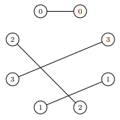
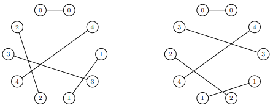
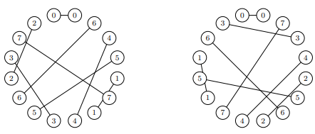
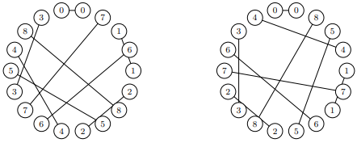
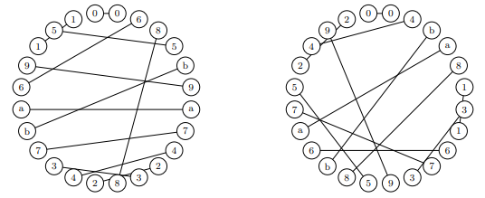

# Cyclic Skolem Sequences

We count numbers, $\chi_n$, of "Cyclic Skolem Sequences" of order $n$ under dihedral equivalence. These correspond to pairings of vertices on a $2n$-gon such that each vertex in its pair is separated from its partner by a different number of edges, necessarily from the set $\{1, 2, \dots, n\}$.

Solutions are encoded as a (cyclic) string of length $2n$ containing the symbols $0, 1, \dots, n-1$ exactly twice. The two occurrences of symbol $k$ are separated by exactly $k$ characters along the shorter length of the cycle.

To canonicalize a solution with regard to its $4n$ rotations and reflections (considered equivalent), we count solutions fixed at the beginning of the string with prefix `"00"`, adopting the lexicographically smaller of the two mirror images (the rest of the string or its reversal).

## Examples for $n=4, 5, 8, 9, 12$

<p align="center">
    
    <br>
    <em>The only octagonal solution (n=4): 00231213</em>
</p>

<p align="center">
    
    <br>
    <em>The two decagonal solutions (n=5): 0023421314 0032412134</em>
</p>

<p align="center">
    
    <br>
    <em>A pair of hexadecagonal solutions (n=8): 0027326534171546 0036151742652437</em>
</p>

<p align="center">
    
    <br>
    <em>A pair of octadecagonal solutions (n=9): 003845376425821617 004367238256171458</em>
</p>

<p align="center">
    
    <br>
    <em>A pair of icositetragonal solutions (n=12): 0015196ab734283247a9b586 00294257a6b8593761318ab4</em>
</p>

---

## Parity Invariant & Orbit Census

The condition $n \equiv 0, 1 \pmod 4$ is necessary for the existence of such a sequence (similar to linear Skolem sequences). Thus valid orders are $n = 1, 4, 5, 8, 9, 12, 13, 16, 17, 20, \dots$.

| $n$ | $M(n)$ (All Matchings) | $B(n)$ (OEIS A054499) | $R_{\vert G\vert}(n)$ (Asymmetric) | $\chi_n$ (Skolem Orbits) |
| ---: | ---: | ---: | ---: | ---: |
| **1** | 1 | 1 | - | 1 |
| **4** | 105 | 17 | 1 | 1 |
| **5** | 945 | 79 | 24 | 2 |
| **8** | 2,027,025 | 65,346 | 61,451 | 192 |
| **9** | 34,459,425 | 966,156 | 948,464 | 1,200 |
| **12** | 316,234,143,225 | 6,589,356,711 | 6,587,070,085 | 456,960 |
| **13** | 7,905,853,580,625 | 152,041,845,075 | 152,029,453,008 | 4,009,024 |
| **16** | 191,898,783,962,510,625 | 2,998,419,746,654,530 | 2,998,417,252,355,055 | 4,377,344,000 |
| **17** | 6,332,659,870,762,850,625 | 93,127,358,763,431,113 | 93,127,343,318,143,792 | 51,487,228,672 |

### Context of Columns:
* $M(n) = (2n-1)!! = \frac{(2n)!}{2^n n!}$: Total unrestricted perfect matchings on $2n$ vertices.
* $B(n) \approx \frac{(2n-1)!!}{4n}$: Number of dihedrally inequivalent chord diagrams ([OEIS A054499](https://oeis.org/A054499)).
* $R_{|G|}(n)$: Number of chord diagrams with trivial stabilizer (regular orbits of size $|D_{2n}| = 4n$). Skolem sequences are strictly a subset of regular orbits because distinct chord lengths preclude non-trivial rotational or reflectional symmetry.

### OEIS References
* **[OEIS A054499](https://oeis.org/A054499)**: Dihedrally equivalent $n$-chord diagrams.
* **[OEIS A390360](https://oeis.org/A390360)**: Canonical $D_{2n}$ cyclic Skolem sequences for odd $n \equiv 1 \pmod 4$ ($n=1, 5, 9, 13, 17, \dots$).
* **[OEIS A392247](https://oeis.org/A392247)**: Canonical $D_{2n}$ cyclic Skolem sequences for even $n \equiv 0 \pmod 4$ ($n=4, 8, 12, 16, 20, \dots$).

---

## Asymptotic Bounds & Analytical Breakthroughs

### 1. Old Unrestricted Matching Bound
$$B(n) \approx \frac{(2n-1)!!}{4n} \sim \left(\frac{2n}{e}\right)^n$$
Counts all chord matchings without enforcing distinct distance constraints $\{1, 2, \dots, n\}$.

### 2. Tight Analytical Upper Bound
Accounting for distinct cyclic distance constraints and quotienting by the dihedral action of order $4n$ yields the tight analytical bound:
$$\chi_n \le \frac{(2n)!}{2^{n+3} n^{n+1}} \approx \frac{\sqrt{\pi}}{4 \sqrt{n}} \cdot \left( \frac{2n}{e^2} \right)^n \approx \frac{0.4431}{\sqrt{n}} \left( 0.2707 \cdot n \right)^n$$

This improves upon the unconstrained bound by an exponential factor of $(1/e)^n \approx (0.3679)^n$.

### Comparative Bound Table:
| $n$ | Actual Skolem Orbits $\chi_n$ | Old Bound $B(n)$ | Tight Bound $\frac{(2n)!}{2^{n+3} n^{n+1}}$ | Improvement Factor |
| :---: | :---: | :---: | :---: | :---: |
| **4** | **1** | 6 | **10.5** | **0.6x** |
| **5** | **2** | 47 | **42.3** | **1.1x** |
| **8** | **192** | 63,344 | **1,732** | **36.5x tighter** |
| **9** | **1,200** | 957,206 | **10,211** | **93.7x tighter** |
| **12** | **456,960** | $6.58 \times 10^9$ | **4,917,215** | **1,339x tighter** |
| **13** | **4,009,024** | $1.52 \times 10^{11}$ | **43,456,920** | **3,498x tighter** |
| **16** | **4,377,344,000** | $2.99 \times 10^{15}$ | **37,842,674,831** | **79,233x tighter** |
| **17** | **51,487,228,672** | $9.31 \times 10^{16}$ | **445,410,230,051** | **209,082x tighter** |
| **20** | $\approx 1.193 \times 10^{14}$ (Est.) | $3.99 \times 10^{21}$ | **46,379,493,576,648** | **86,199,608x tighter** |

### 3. Empirical Ratio Convergence & The $n=20$ Frontier
Comparing exact orbit counts against the tight bound $T(n) = \frac{(2n)!}{2^{n+3} n^{n+1}}$, the ratio $\chi_n / T(n)$ converges rapidly to the asymptotic constant:
$$\frac{\chi_n}{T(n)} \longrightarrow \mathbf{2.572 \pm 0.001}$$

* $n=12$: $2.5821$
* $n=13$: $2.5651$
* $n=16$: $2.5742$
* $n=17$: $2.5717$

Applying this constant to $T(20) = \frac{40!}{2^{23} \cdot 20^{21}} = 46,379,414,200,595$ predicts:
$$\chi_{20} \approx 2.572 \times T(20) \approx \mathbf{1.193 \times 10^{14}} \quad (\approx \mathbf{119.3 \text{ trillion canonical orbits}})$$

---

## Building & Running the Rust Solver

A high-performance multi-threaded solver in Rust is provided in the `solver/` directory.

### Prerequisites
* Rust toolchain: `curl --proto '=https' --tlsv1.2 -sSf https://sh.rustup.rs | sh`

### Quick Start
```bash
# Build the release binary
cd solver
cargo build --release

# Count canonical dihedral orbits for n=8
cargo run --release -- -n 8

# Enumerate all canonical solutions for n=9 as Base36 strings
cargo run --release -- -n 9 -f base36

# Display analytical bounds comparison for n=16
cargo run --release -- -n 16 --bound

# Export solutions to a JSON file using 8 threads
cargo run --release -- -n 12 -t 8 -f json -o solutions_n12.json
```

### CLI Command Options
```text
Options:
  -n, --n <N>              Number of chords n (e.g. 1, 4, 5, 8, 9, 12, 13, 16, 17, 20)
  -g, --group <GROUP>      Symmetry group [default: dihedral] [possible values: dihedral, cyclic, none]
  -f, --format <FORMAT>    Output format [default: count] [possible values: count, base36, chords, json, b-file]
  -t, --threads <THREADS>  Number of worker threads (default: all CPU cores)
      --shard <M/N>        Distributed sharding in format M/N (e.g. 1/16, 2/16)
  -b, --bound              Display analytical bounds (flabby vs tight)
  -o, --output <FILE>      Output destination file path (default: stdout)
```

### Measured Performance Benchmarks
Running on a standard multi-core workstation:

| $n$ | Canonical Orbits $\chi_n$ | Solver Throughput | Measured Execution Time |
| :---: | :---: | :---: | :---: |
| **8** | 192 | $5.30 \times 10^4$ sol/s | 0.0036 s |
| **9** | 1,200 | $3.11 \times 10^5$ sol/s | 0.0039 s |
| **12** | 456,960 | $1.96 \times 10^6$ sol/s | 0.2335 s |
| **13** | 4,009,024 | $1.63 \times 10^6$ sol/s | 2.4619 s |
| **16** | 4,377,344,000 | $6.05 \times 10^5$ sol/s | 7,235.86 s (2.01 hours) |
| **17** | 51,487,228,672 | $5.22 \times 10^5$ sol/s | 98,653.05 s (27.40 hours) |
| **20** | $\approx 1.193 \times 10^{14}$ (Est.) | $\approx 5.0 \times 10^5$ sol/s | $\approx 7.5$ years (1 machine) / $\approx 66$ hours (1000 nodes) |

Because the solver operates in $O(1)$ stack memory with zero cross-thread communication, large computations can be partitioned across distributed cloud nodes using the `--shard <M/N>` flag (e.g. `cargo run --release -- -n 20 --shard 1/1000`).

---

## Base36 Sample Solutions ($n=18$, length 36)

While Skolem sequences form an infinitesimally small fraction of all asymmetric diagrams as $n \to \infty$ (the probability of finding a cyclic Skolem sequence within any unrestricted superset is effectively zero), individual instances remain inexpensive and tractable to find with the solver. For example, here are several valid sequences of length 36 ($n=18$, chord distance profile $1\dots 18$):

    001q1pytfmdwilxr4jan64vohuk6gaqpmczl3s5b3yhe5gckotwbx8v7u2er2987fisndjz9
    004b96vgplusmqje5xw8z35c73ft8nel7yjmcrvosufh2dk21a1winpxztqdahgbor9ky46i
    00546bwd5stpyoli1b1v7dz9rhuj7xegm9fklpswtn3hqe3jgyfarc8mkuzvo2a82ncxi64q
    005v28b2nkctxo8ryzlqi74cpw94s7kunmdv9eoiltf3ghq3djxyeza1m1fr6guhwab65jps
    007rsdhpitqbexzjnm3yol3bgc5kuwvr5s2ja2ctmg181ofak4zx8p4qy96uhifdn679wevl
    009e4tlpa4z69jqbhk6yomwvxi5b2ru25jhtcs8fnqg1i1z83c7d3pyflr7gewxvndsokamu
    00dvqlzm9h51k1bf5j9supntxrbhwymf3kov3j2a42zc847peqagi87lc6xoduse6tywgrni
    00eovxwpm3iad3fghn1t1rauzqdyoifmgph6vk4xsn648wl97tcj28b279kez5ycurb5lsqj
    00fxpdsl92y527jcv59dh7wzo3tic3pbrk6gqxhun6mb8yievsa4g8kw4lfzraeqnmj1t1uo
    00k7e1z1fl4qsnj4wu5extvc56r3bga36iy2cp28bazdomgh8w9tikxsqdul9nvpfhj7mory

where alphanumeric characters `0`..`z` encode distance values $0\dots 35$.

It has not escaped the author's notice that the strictly distinct cyclic pairings exhibited by these sequences immediately suggest a possible mechanism for human-auditable, tamper-evident encoding, optical orthogonal pulse timing, and conflict-free cyclic scheduling.

